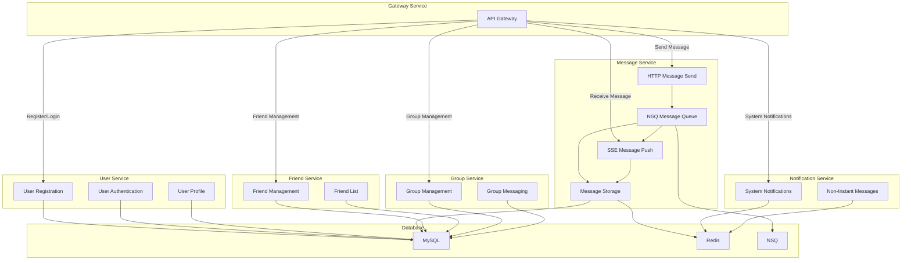
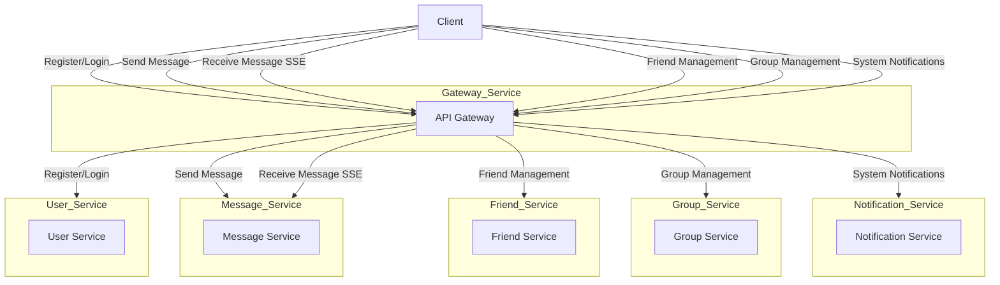

# 结构
```shell
.
├── consumer
├── go.mod
├── internal
│   └── model
├── job
├── pkg
├── restful
├── script
└── service
```

```html
consumer： 队列消费服务
internal： 工程内部可访问的公共模块
job： cron job 服务
pkg： 工程外部可访问的公共模块
restful：HTTP 服务目录，下存放以服务为维度的微服务
script：脚本服务目录，下存放以脚本为维度的服务
service：gRPC 服务目录，下存放以服务为维度的微服务
```

# 架构图


