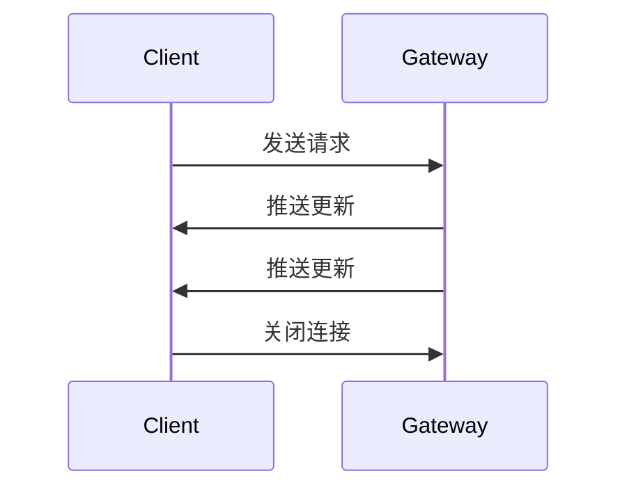

# 采用SSE模式

## 客户端主动请求 & 服务器主动推送

```mermaid
sequenceDiagram
    participant Client
    participant Gateway
    
    Client->>Gateway: 发送请求
    Gateway->>Client: 推送更新
    Gateway->>Client: 推送更新
    Client->>Gateway: 关闭连接
```

# 常规API
1. 登陆
2. 注册
3. 修改个人信息
4. 好友列表
5. 群组列表
6. 发送消息

# SSE API
1. 实时消息
2. 在线状态更新
3. 消息列表
