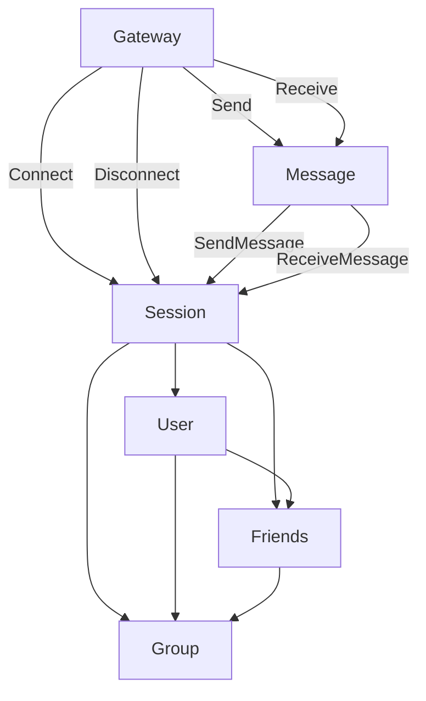
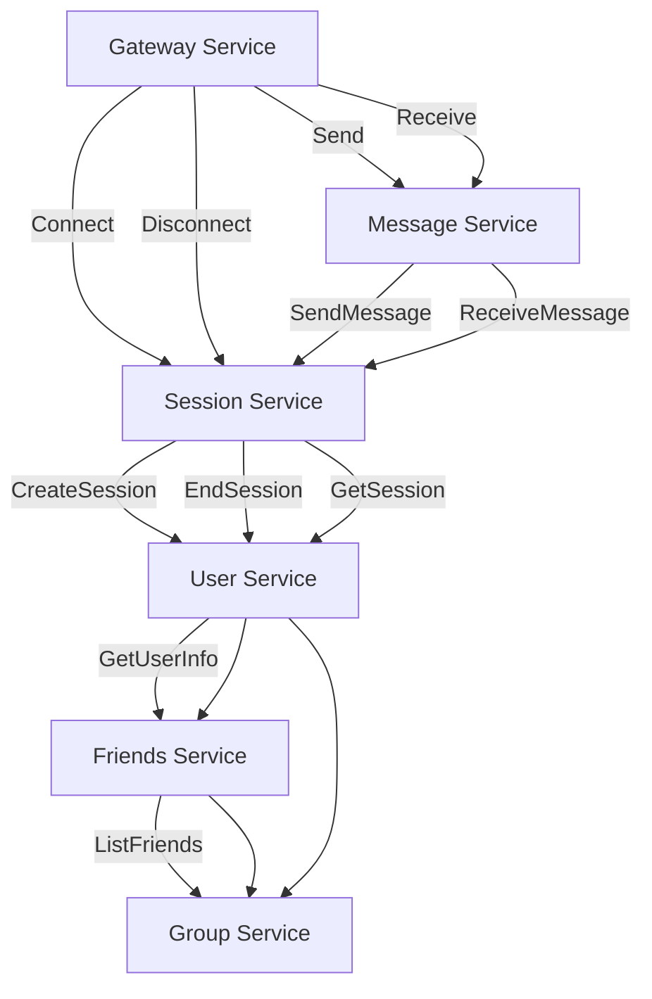
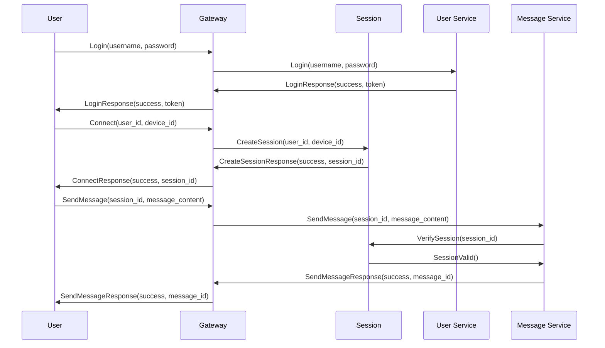

# 服务器关系

```mermaid
graph TD;
    Gateway -->|Connect| Session;
    Gateway -->|Disconnect| Session;
    Gateway -->|Send| Message;
    Gateway -->|Receive| Message;
    Session --> User;
    Session --> Friends;
    Session --> Group;
    Message -->|SendMessage| Session;
    Message -->|ReceiveMessage| Session;
    User --> Friends;
    User --> Group;
    Friends --> Group;

```

# 详细的服务关系图和请求流程图

```mermaid
graph TD;
Gateway[Gateway Service]
Session[Session Service]
User[User Service]
Friends[Friends Service]
Group[Group Service]
Message[Message Service]

    Gateway -->|Connect| Session
    Gateway -->|Disconnect| Session
    Gateway -->|Send| Message
    Gateway -->|Receive| Message

    Session -->|CreateSession| User
    Session -->|EndSession| User
    Session -->|GetSession| User

    User -->|GetUserInfo| Friends
    Friends -->|ListFriends| Group

    Message -->|SendMessage| Session
    Message -->|ReceiveMessage| Session
    User --> Friends
    User --> Group
    Friends --> Group
```

# 用户登陆和发送信息流程图

```mermaid
sequenceDiagram
    participant User
    participant Gateway
    participant Session
    participant UserService as User Service
    participant MessageService as Message Service

    User->>Gateway: Login(username, password)
    Gateway->>UserService: Login(username, password)
    UserService->>Gateway: LoginResponse(success, token)
    Gateway->>User: LoginResponse(success, token)

    User->>Gateway: Connect(user_id, device_id)
    Gateway->>Session: CreateSession(user_id, device_id)
    Session->>Gateway: CreateSessionResponse(success, session_id)
    Gateway->>User: ConnectResponse(success, session_id)

    User->>Gateway: SendMessage(session_id, message_content)
    Gateway->>MessageService: SendMessage(session_id, message_content)
    MessageService->>Session: VerifySession(session_id)
    Session->>MessageService: SessionValid()
    MessageService->>Gateway: SendMessageResponse(success, message_id)
    Gateway->>User: SendMessageResponse(success, message_id)


```
